# GMC三服百科

## 目录
注：所列出的结构中仅含箱子内可开出特殊附魔的结构，其他新增结构不进行列举

1. [新增命令](#LQN3y)
2. [新增附魔](#kvptu)
3. [新增敌对结构](#DR6Z0)
4. [新增试炼](#SCpmy)

## 新增命令
#### 随机传送/rpt
使用该命令将会使你传送至距离自己1000-5000格外的随机坐标

该命令仅能在主世界使用

该命令每个月只能用6次，每个月月末进行次数重置

## 新增附魔
注：

1. 绿字条目为普通附魔，可以通过附魔台和试炼获取
2. 蓝字条目为稀有附魔，只能通过新增试炼宝库获取
3. 黄色条目为史诗附魔，只能通过新增Boss/不详宝库获取
4. 彩色条目为传说附魔，只能通过新增Boss/不详宝库获取且概率为其他新增附魔的3/100
5. 灰色词条为附魔台诅咒，仅出现于附魔台获得的装备和村民交易

#### 装备附魔
##### 毒素免疫I（antidote）
应用于胸甲，免疫中毒伤害

中毒时会持续扣除胸甲耐久

##### 坚韧IV（armor_toughness）
应用于下界合金护甲

提高0.5/1.0/1.5/2.0盔甲韧性。与重装冲突。

与重装冲突

只在苦力怕试炼宝库中出现

##### 重装V（armor）
应用于下界合金护甲

提高0.5/1.0/1.5/2.0/2.5护甲值

与坚韧冲突

##### 炽焰反制III（fire_thorns）
应用于所有护甲

受到攻击有15%概率点燃攻击者并造成1-3点火焰伤害，并点燃目标4/8/12秒

每一级增加15%触发概率，降低自身10%着火时间

只在猪灵试炼/烈焰人试炼宝库中出现

##### 凛寒气场III（freezing_thorns）
应用于所有护甲

受到攻击有15%概率减速攻击者并造成2-5冰冻伤害

每一级增加15%触发概率

只在流浪者试炼宝库中出现

##### 肘击IV（elbow_strike）
仅应用于下界合金胸甲

提高0.5/1.0/1.5/2.0点基础攻击力

##### 轻盈III（jump_boost）
应用于护腿

每一级增加0.25格跳跃高度

##### 不移II（knockback_resistance）
应用于护甲

每一级提高5%击退抗性和10%爆炸击退抗性

只在苦力怕试炼宝库中出现

##### 敏捷III（traveler）
应用于靴子

提高疾跑速度，每级增加0.015运动速度

只在流浪者试炼宝库中出现

##### 生命提升IV（health_boost）
仅应用于下界合金胸甲

提高2/4/6/8点最大生命值

##### 触及IV（outreach）
应用于胸甲

每级增加0.5格触及距离

##### 监守者之庇I（warden_protect）
应用于头盔

每次受到其他实体的伤害时，有5%概率在此实体脸上召唤一只监守者（注：在未携带监守者伴侣附魔时你仍会被其攻击）

你的48格内仅可存在1只监守者

##### 监守者伴侣I（warden_love)
应用于头盔

监守者将不会视你为目标，且你免疫监守者的黑暗效果

注：若监守者已索敌于你，后戴上含此附魔的头盔并不能使你摆脱它（此附魔只能减免监守者对你增加愤怒值）

特别地：在樱花试炼灾厄宝库中概率再提升3%

#### 武器附魔
##### 刌民杀手V（illagers_bane）
应用于剑

每一级对刌民额外造成2.5伤害

通过附魔台获取的最大等级为IV

##### 强劲V（power）
应用于弩

类似于弓的力量，每一级增加25%伤害

##### 分裂箭I（multishot）
应用于弓

类似于弩的多重射击，射出三根箭

##### 贯穿IV（piercing）
应用于弓

类似于弩的穿透，可以穿透多个实体和破盾

##### 狂热III（attack_speed）
应用于任意武器

增加0.2/0.4/0.6攻击速度

##### 致命一击V（critical_blow）
仅应用于下界合金斧

攻击时有8%概率造成3/4/5/6/7倍伤害

只在樱花试炼宝库中出现

##### 衰败II（wither_coated）
应用于剑

攻击敌人额外附带3秒凋零II效果，每一级延长3秒

特别地：在烈焰人试炼中获得概率将得到提升

##### 混沌打击I（potion_master)
应用于弓

射出的箭击中敌人后使敌人得到随机一种药水效果

注：药水效果为所有药水效果，但不含潮涌能量、海豚的恩惠、不祥之兆、村庄英雄、试炼之兆、袭击之兆

药水效果为1-3级随机等级，1-10s随机持续时间， 无粒子

与无限、多重箭冲突

##### 引爆III（boom_bow)
应用于弓

射出的箭矢若击中生物将有0.05/0.1/0.15概率引起一次不会破坏方块的爆炸，爆炸等级为2/3/4，爆炸击退等级1/1.5/2（参考：苦力怕爆炸等级为3，爆炸击退等级为1）

附魔后蓄力时间增200%

与无限、贯穿、分裂箭冲突

##### 
#### 其他附魔
##### 曼巴之力（kobe_bryant）
应用于鞘翅

避免在末地坠机掉入虚空

##### 涂蜡（wax_wings）
应用于鞘翅

在飞行速度小于30m/s时不消耗耐久

##### 铁翼（elytra_protection）
应用于鞘翅

每一级减少6%受到的伤害

只在末地城试炼宝库（特：末地船钥匙）中出现

##### 蛮力抵抗（shield_protect）
应用于盾牌

不会被破盾，但该盾牌的耐久损失速度为原来的1.5倍

与耐久、经验修补、无限耐久冲突

##### 无限耐久I（infinite_durability）
应用于任意有耐久的物品上

可以使该物品不会损失耐久度

#### 诅咒
##### 劣质I（inferior_curse）
应用于任意有耐久的物品

使物品耐久消耗速度提高300%

##### 坠机I（plane_crash_curse）
应用于靴子

使摔落伤害提高900%

##### 原神启动I（genshin_start_curse)
应用于任意护甲

当受到攻击时，在自己和对方的屏幕中央显示“原神，启动！”

## 新增敌对结构
注：这些结构内箱子中都有概率含特殊附魔书

##### 刌民矿工前哨站(badlands_miner_outpost)
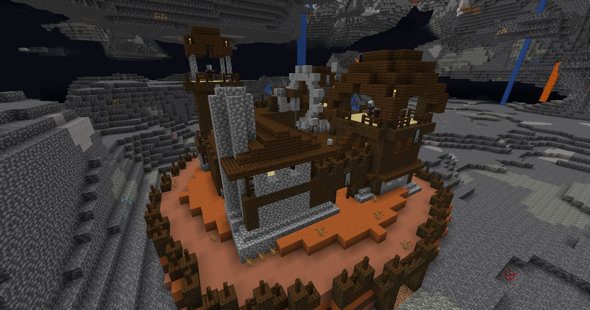

存在于地上

##### 沙漠废墟（desert_ruins）
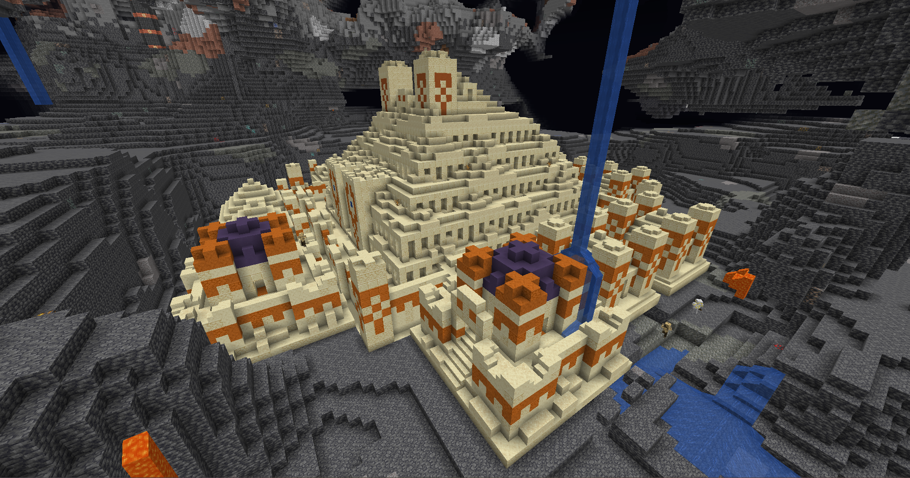

存在于地上

结构中有小部分精英怪

##### 刌民地堡（illager_hideout）
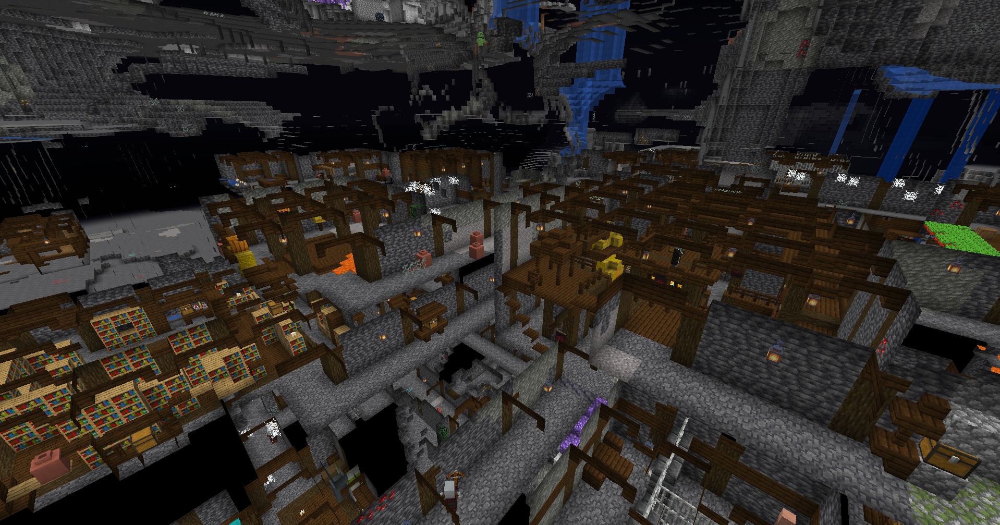

深埋地下，内含少部分刌民和村民

##### 丛林神庙废墟（jungle_ruins）
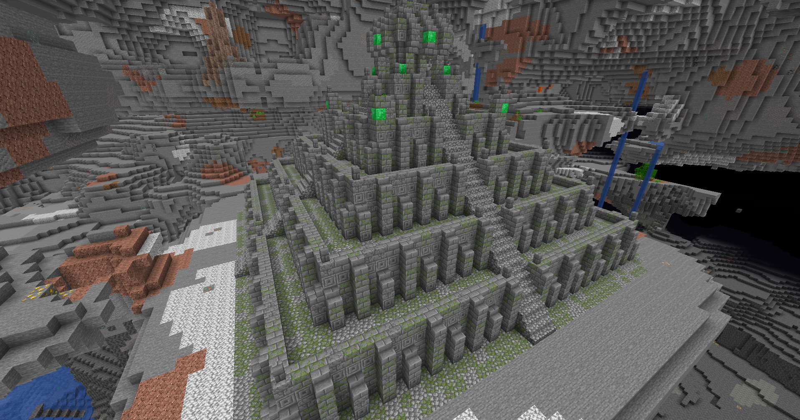

存在于地上

结构中有小部分精英怪和大量机关

##### 流浪堡垒（stray_fort）
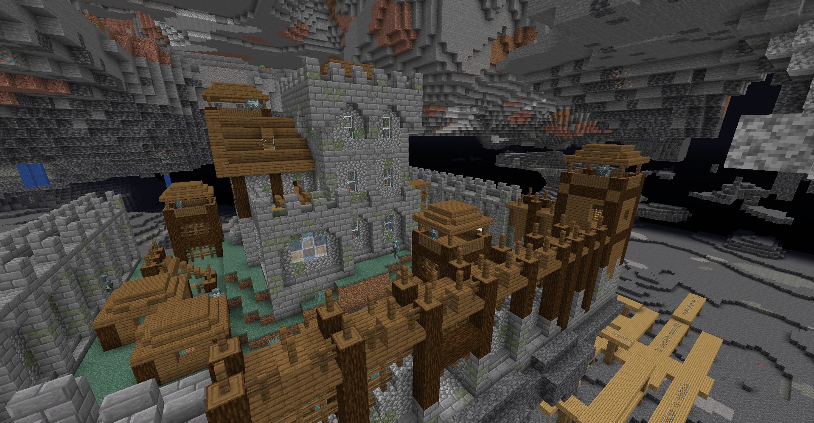

里面只有流浪者

##### 下界堡垒
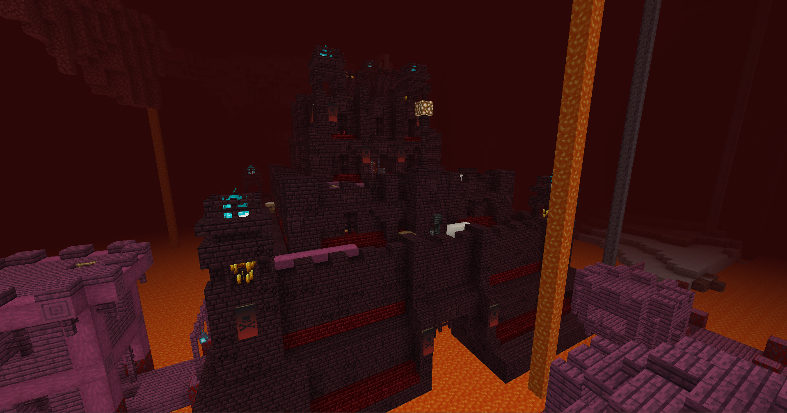

## 新增试炼
##### 苦力怕试炼（creeping_crypt）
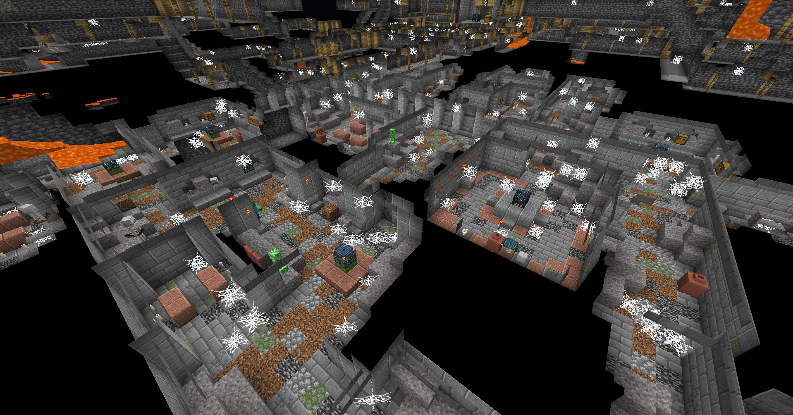  
该试炼通常深埋地下，并有一段很长的竖井通向地面。

###### 宝库钥匙概率
普通试炼模式：1/10

灾厄试炼模式：1/4

##### 流浪者试炼（lone_citadel）

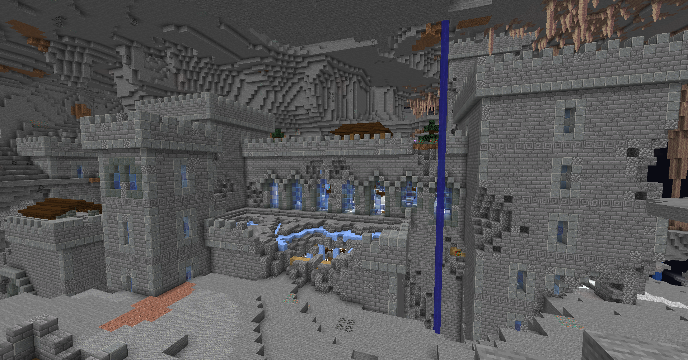

该试炼地表为城堡，地下为地牢，内含试炼

###### 流浪者试炼刷怪笼掉落钥匙概率
普通试炼模式：1/10

灾厄试炼模式：1/7

###### Boss刷怪笼
普通试炼模式：2/3掉落Boss宝库钥匙

灾厄试炼模式：1/1掉落Boss宝库钥匙

###### 旋风人试炼刷怪笼掉落钥匙概率
普通试炼模式：1/10

灾厄试炼模式：1/5

##### 闯关试炼（shrine_combat_tier）
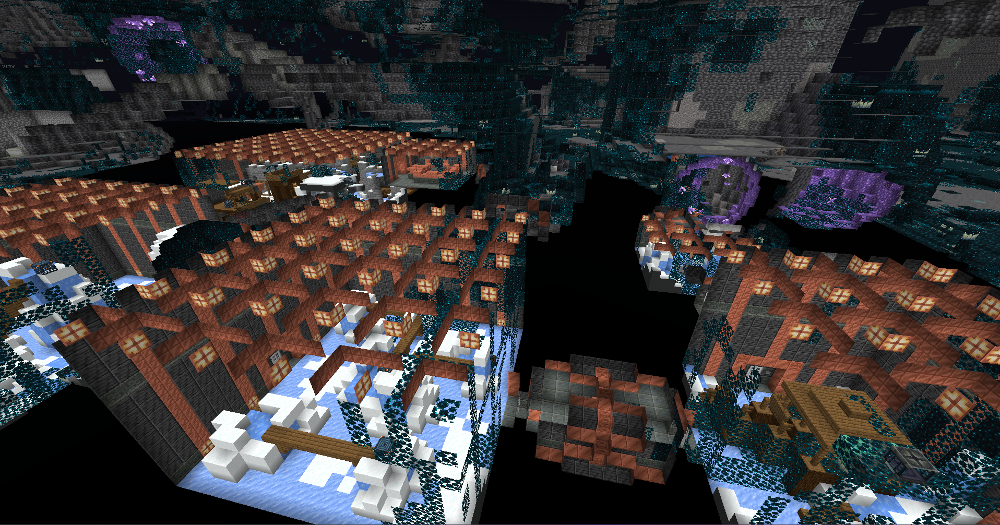

该试炼结构有1-5级不同的形态，试炼密室数量和级别一致（即1级只有一个密室，5级有五个密室）

该试炼深埋地下，入口有长通道通向地面，从入口进入可以依次通过不同的试炼密室（所以我管他叫闯关试炼哈哈哈）

###### 所有刷怪笼掉落钥匙概率
普通试炼模式：普通钥匙1/4

灾厄试炼模式：灾厄钥匙1/4

##### 毒穴试炼（toxic_lair）
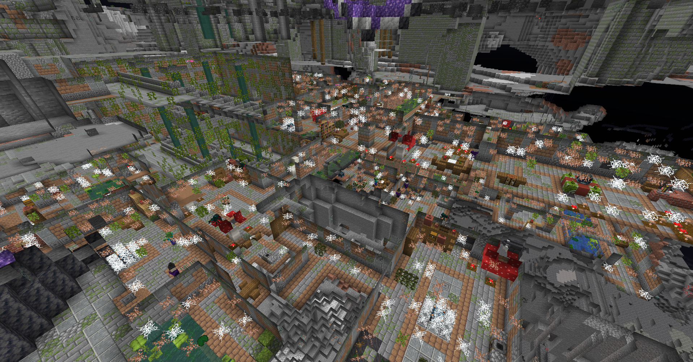

内含大量毒蜘蛛/女巫/僵尸村民

###### 史莱姆试炼刷怪笼掉落钥匙概率：0
###### Boss蜘蛛试炼刷怪笼掉落Boss钥匙概率
普通试炼模式：1/1

灾厄试炼模式：1/1

###### 其他试炼刷怪笼掉落钥匙概率
普通试炼模式：普通钥匙1/4

灾厄试炼模式：灾厄钥匙1/5

##### 水牢试炼（trident_trial_monument）
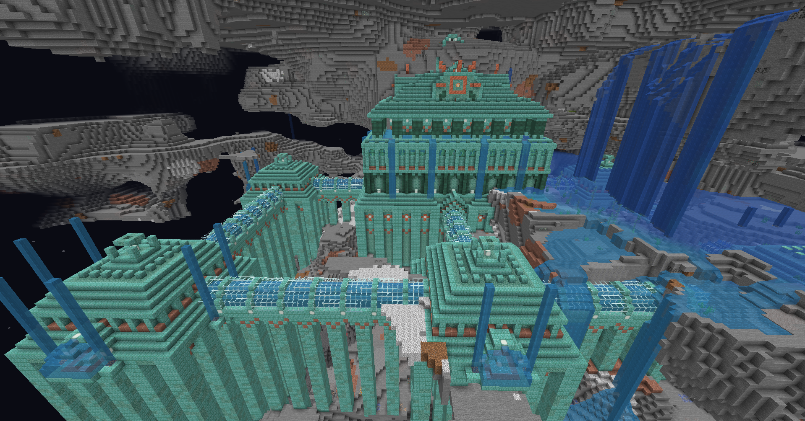

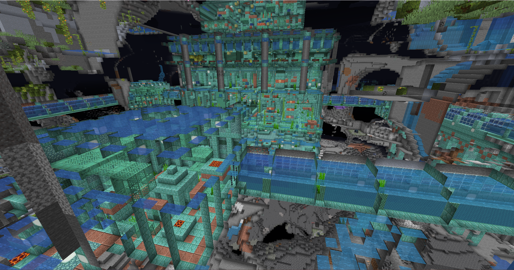

内含各种水怪

（图一是整体外观预览图，实际上线后不会出现裸露在地表的问题）

###### Boss试炼刷怪笼掉落Boss钥匙概率
普通试炼模式：1/1

灾厄试炼模式：1/1

###### 守卫者试炼刷怪笼掉落钥匙概率
普通试炼模式：1/5

灾厄试炼模式：1/4

###### 其他试炼刷怪笼掉落钥匙概率
普通试炼模式：1/7

灾厄试炼模式：1/4

##### 樱花试炼
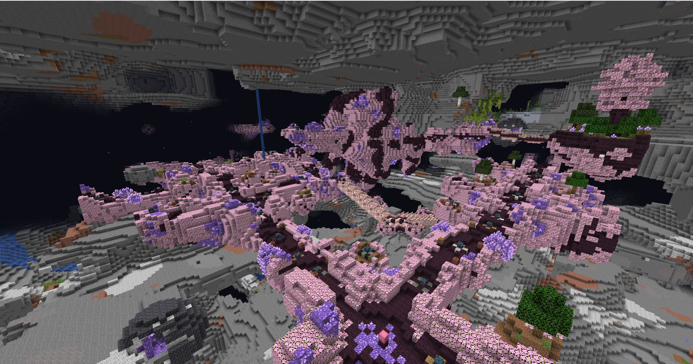

不用介绍了，伟大无需多言

###### 掉落钥匙概率
无视灾厄效果，统一为1/10，其中灾厄钥匙出现概率占1/6

##### 烈焰人试炼（nether_keep）
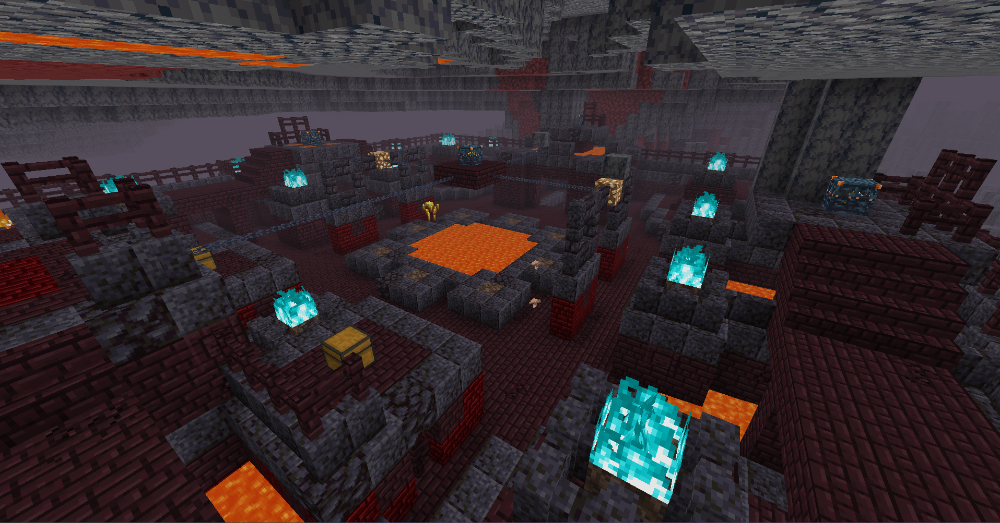

###### 烈焰人Boss试炼刷怪笼：
普通试炼模式：1/1

灾厄试炼模式：1/1

###### 其他试炼刷怪笼：
普通试炼模式：1/4

灾厄试炼模式：1/3

##### 猪灵试炼（piglin_donjon）
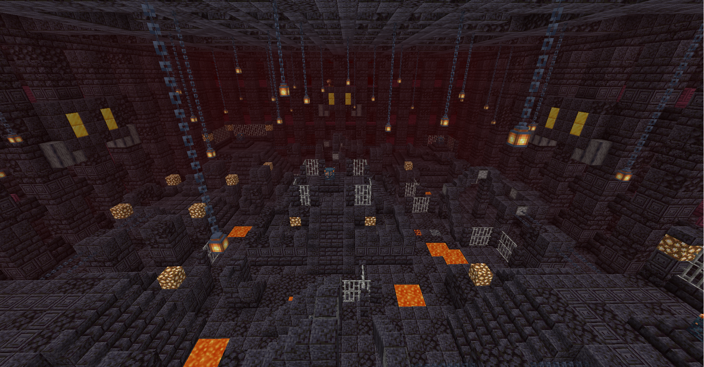

###### 恶魂试炼刷怪笼掉落钥匙概率
普通试炼模式：1/2

灾厄试炼模式：1/1

###### 疣猪兽试炼刷怪笼掉落钥匙概率
普通试炼模式：1/10

灾厄试炼模式：1/2

###### 其他试炼刷怪笼掉落宝库钥匙概率
普通试炼模式：1/10

灾厄试炼模式：1/4

##### 猪灵前哨站试炼（piglin_outstation）
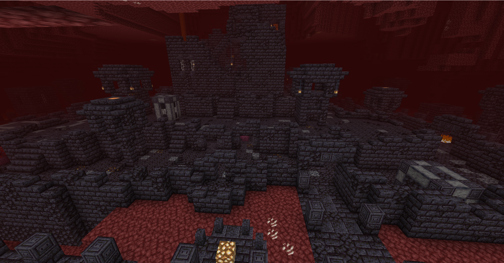

###### 岩浆怪试炼刷怪笼掉落钥匙概率
普通试炼模式：1/3

灾厄试炼模式：1/2

##### 末地堡垒试炼（end_castle）
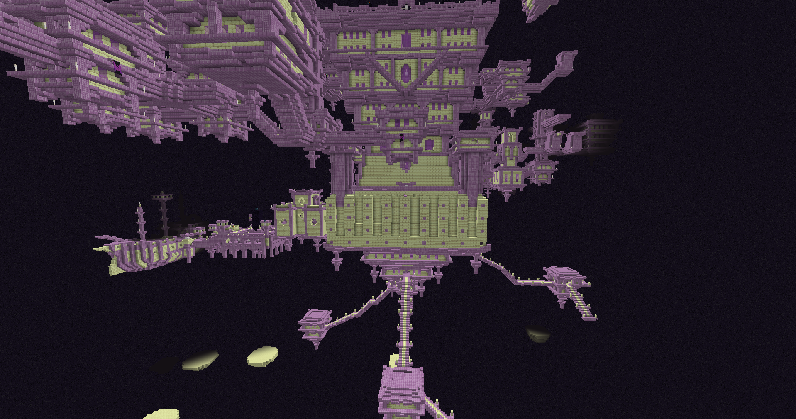

注意：末地城堡宝库中不刷特殊附魔书，末地船宝库中含所有新增附魔

注：末地船钥匙并不是只能开末地船里的宝库，具体可开的宝库请自行尝试

###### 末影螨试炼刷怪笼掉落钥匙概率
普通试炼模式：1/5掉落末地城堡宝库钥匙

灾厄试炼模式：1/5掉落末地船宝库钥匙

###### 幻翼试炼刷怪笼掉落钥匙概率：0
###### 潜影贝试炼刷怪笼掉落钥匙概率
普通试炼模式：1/9掉落末地城堡宝库钥匙

灾厄试炼模式：1/9掉落末地船宝库钥匙

###### 潜影贝迷你boss刷怪笼掉落钥匙概率
普通试炼模式：1/5掉落末地城堡宝库钥匙

灾厄试炼模式：1/5掉落末地船宝库钥匙

###### Boss刷怪笼
普通试炼模式：2/3掉落末地船宝库钥匙

灾厄试炼模式：1/1掉落末地船宝库钥匙

> 更新: 最后编辑于2025/2/2 Zhongzi8972